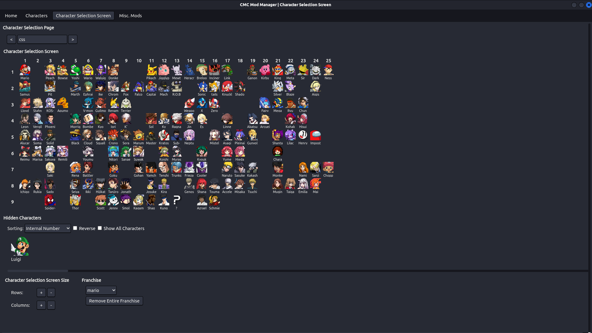

# CMC Mod Manager
Usage of this mod manager will 'spoil' the hidden characters as they are displayed in the program without the locked icon.
## What
This project is a WIP mod manager for Super Smash Brothers Crusade CMC+. It allows for the installation and management of mods through a GUI.
### Supported Versions
- [x] [CMC+ v8](https://gamebanana.com/mods/50383)
- [x] [CMC+ v7.1.1](https://gamebanana.com/mods/50383)
- [x] [CMC+ Open Build](https://discord.gg/kAbEBkx5Y4)
## Why
CMC+ has good modding support and modding the game currently isn't that hard why use a mod manager? The main reason I developed this mod manager is for the CSS (Character Selection Screen) editor. Although it is certainly possible, adding characters to the CSS by hand annoyed me because of the need to find character numbers and names (if you are removing unknown characters). CMC Mod Manager allows you to add, swap or remove characters to/from the CSS (and soon the SSS) with drag and drop.

## Installation
Go [here](https://github.com/Inferno214221/CMCModManager/releases/latest) to install the latest release of CMC Mod Manager for your operating system.
### Windows
After downloading the zip, extract it in the directory you wish to install it in and run the exe.
#### NOTE:
When installing the basegame, merging, installing mods or completing any other task that requires file system operations Windows will say that the program is not responding. This is Window's fault, not mine, the program is actually doing what it is supposed to, just wait for it to finish. The program makes two copies of the game, one without mods and one with mods, so it will sometimes take a while (I'm running it on an M.2 and I still had this issue so please just be patient).
### Linux
After downloading the zip, extract it and copy the `/out/cmcmodmanager-linux-x64/` folder to where you would like to install it, e.g. `/opt` (Feel free to rename it as well). Due to CMC+ being built for Windows, the default permissions are very weird with some directories being read-only. To fix this it is very important that you run `sudo chmod 777 ./* -R` in your CMC game directory before installing it with your mod manager, otherwise, the program will be unable to remove some of the files it is using.
#### NOTE:
If you are having issues running SSBC / CMC+ on Linux, use Wine version 6 rather than 7 or 8 and it plays perfectly (Idk what proton version).
### MacOS
Install [Asahi Linux](https://asahilinux.org/), then proceed with the Linux installation steps. 
#### NOTE:
The above statement is double reverse sarcastic.
## Usage
Please ensure that the game has been run once to create all the necessary files.

After installing CMC Mod Manager the first step is to import the basegame. Under the 'Home' tab select 'Import Basegame' and select the folder with CMC's exe in it. After pressing OK, the mod manager will make a copy of the game in its own directory, which might take a while. Afterwards, you can delete the previous copy and only use the mod manager's if you'd like to save space. When importing the basegame or merging mods on Windows, it is very likely that you will receive a warning that the program is not responding. Please ignore this and let it run anyway.

To install character mods, switch to the 'Character Manager' tab and select 'Install from Directory' or 'Install From Archive'. Any characters that you want to install should be formatted correctly so that all of the files in the mod's directory would be copied into the game's without modification (e.g. no separate folders for different game versions). After installing any mod, remember to 'Merge All Mods' from the 'Home' tab.

The 'Character Selection Screen' tab can be used after merging to modify which characters are available to choose from on the selection screen by dragging and dropping characters between the CSS grid and the list underneath.

## It's not working!
Please ensure that all mods that are installed are in the correct format and that the program is the latest version (check GitHub / GB). If a breakage occurred installing a mod, try removing it via the mod manager, or manually in the `installed.json` file and deleting the manager's copy of the mod's folder.

If none of these options are fixing the problem please submit an issue on GitHub with information about what went wrong and when. (Check that no one else has the same issue first.)
## Notes
This is my first time using Electron and therefore the code is a bit of a mess sorry. Also, I am not very good at designing GUIs so this one might be unintuitive. Feel free to provide suggestions for interface improvements although be warned they may be declined.
## Progress
### Main Page
- [x] Install the unmodified version of CMC
- [x] Merge installed characters
- [x] Open basegame and merged directories in local file manager
- [x] Run both the basegame and merged version
- [x] Save and load control profiles
- [x] Determine imported game's version
- [x] Update last merge time
- [x] Persist: contols, settings, record, favourite character, css
- [x] Remove unessecary files
- [x] Make fighters.txt on export
- [ ] Make stages.txt & others on export
- [x] Alerts
- [x] Errors
### Character Manager
- [x] Install characters from a folder (very picky)
- [x] Install characters from a zip (extract, install folder, delete)
- [x] List installed mod characters
- [x] Remove installed characters
- [x] Open installed character's directory
- [x] Change character merge priority
- [x] Delete instructions txt file on merge
- [x] RAR support - no errors
- [x] Installed v7 Characters Can Be Converted To v8
- [x] Errors
### Character Selection Screen (Priority: 1)
- [x] Display the CSS
- [x] Display unincluded characters (not alts)
- [x] Add characters to CSS
- [x] Remove from the CSS
- [x] Sort hidden characters
- [x] Export CSS
- [x] Remove all of a franchise
- [x] Save / load layouts
- [x] Drag and Drop
- [x] Replace characters
- [x] Change the number of rows & columns
- [x] Uninstalled characters are removed
- [x] Switch CSS Pages
- [ ] Add CSS Pages
- [ ] Edit Game Settings to change displayed list
- [x] Alerts
- [ ] Errors
### Alts (Priority: 5)
- [ ] IDFK how I should deal with alts
- [ ] Alerts
- [ ] Errors
### Stage Manager (Priority: 4)
- [ ] Install stages from a folder
- [ ] Install stages from a zip (extract, install folder, delete)
- [ ] Manage stage merge priority
- [ ] Alerts
- [ ] Errors
### Stage Selection Screen (Priority: 4)
- [ ] Display the SSS w/ pages
- [ ] Display unincluded stages
- [ ] Add stages to SSS
- [ ] Remove from the SSS
- [ ] Sort hidden stages
- [ ] Export SSS
- [ ] Save / load layouts
- [ ] Change the number of rows & columns
- [ ] Add pages
- [ ] Alerts
- [ ] Errors
### Items (Priority: 6)
- [ ] Install item mods - Not many mods & idk if it works with CMC+ v7
- [ ] Remove item mods
- [ ] Alerts
- [ ] Errors
### Miscellanious Mods (Priority: 3)
- [x] Add option to import other types of mods e.g. ui changes / music
- [x] RAR support - no errors
- [x] Errors
### Mod Tools (Priority: 2)
- [ ] Character Extractor
