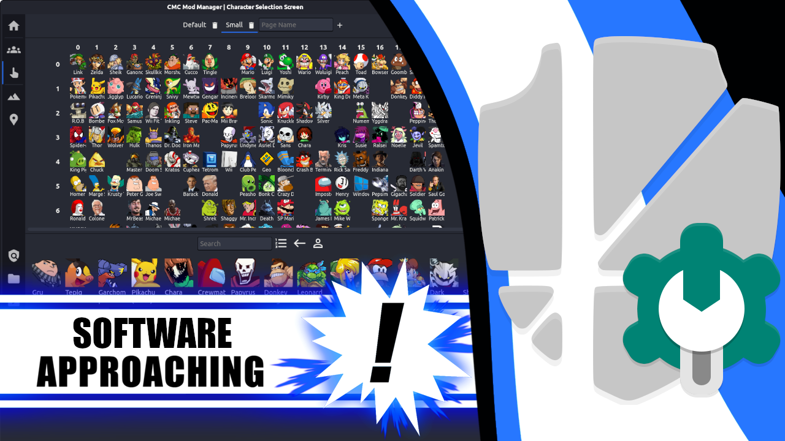
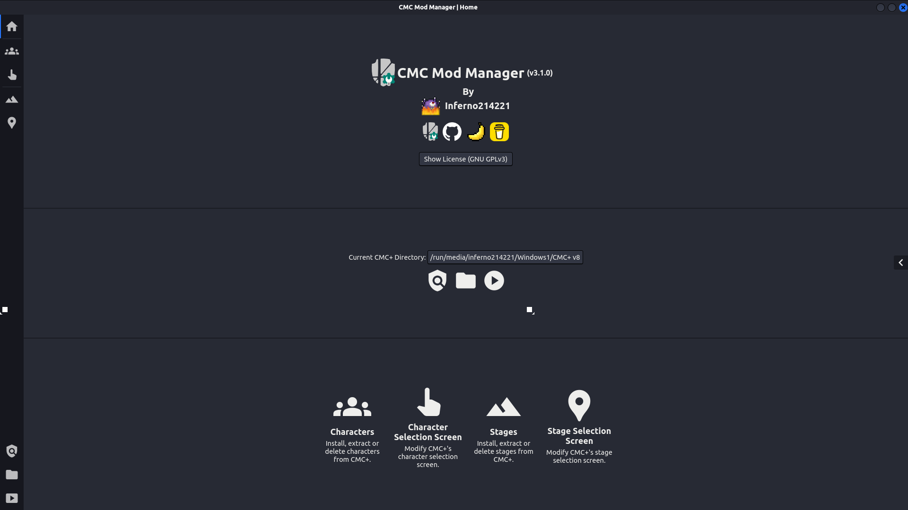
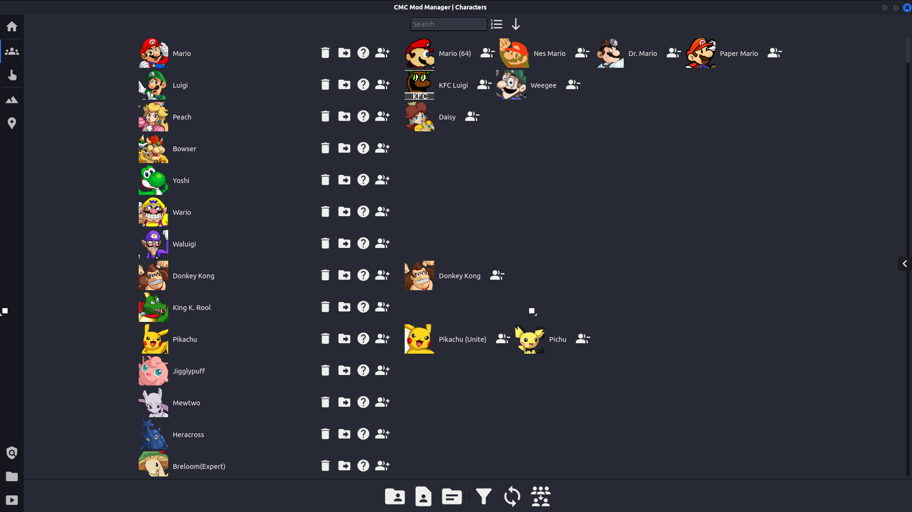
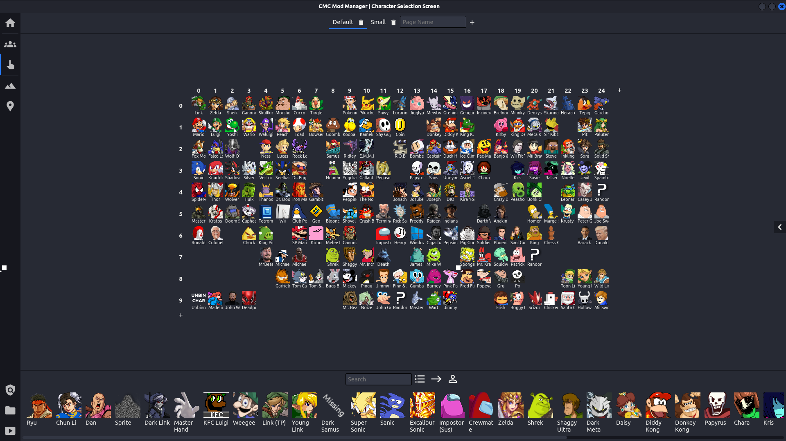
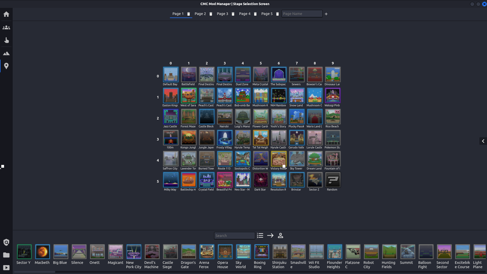

# This content looks significantly better on my website, please consider viewing it [there](https://inferno214221.com/cmc-mod-manager/) instead.

<a href="https://github.com/Inferno214221/cmc-mod-manager/">
	
</a>
<a href="https://gamebanana.com/tools/14136">
	
</a>
<a href="https://www.buymeacoffee.com/inferno214221">
	
</a>

# Page Contents
- [Description](#description)
- [Installation](#installation)
- [Supporting the Project](#supporting-the-project)
- [Development](#development)
- [FAQ](#faq)

# Description
CMC Mod Manager is a tool that aids users in modding the "Modding Community" build of Super Smash Brothers Crusade (SSB CMC+) by providing a graphical interface to install and manage mods including characters and stages. For a game that already has an established modding format, the presence of a mod manager is nonessential, however, this program aims to significantly improve the existing modding experience.

Please note that I'm not responsible for the modding format, nor do I believe that the format was designed with a mod manager in mind. For this reason, some of CMC Mod Manager's limitations may seem strange to users who are new to CMC+.

## Terminology
<details>
	<summary>Firstly, if you are unfamiliar with SSBC, CMC+ or haven't used CMC Mod Manager before, the following table contains a definition of terms and acronyms that this page uses.</summary>
	<table>
		<tr>
			<th>Term</th>
			<th>Definition</th>
		</tr>
		<tr>
			<td>SSBC</td>
			<td><b>S</b>uper <b>S</b>mash <b>B</b>ros <b>C</b>rusade, a Super Smash Bros fan-game with a large modding community.</td>
		</tr>
		<tr>
			<td>CMC+</td>
			<td><b>C</b>rusade <b>M</b>odding <b>C</b>ommunity <b>+</b>, a build of SSBC that modifies the game in various ways, incorporates a large, community-developed roster of characters and provides better modding support.</td>
		</tr>
		<tr>
			<td>Mod</td>
			<td>As a term that is defined very generally, 'mod' could be used to describe the relationship between CMC+ and SSBC, or any other change made to either of these games. Within the context of CMC Mod Manager however, I use the term mod to refer to both characters and stages that are or can be included in SSBC / CMC+.</td>
		</tr>
		<tr>
			<td>Character</td>
			<td>I use the term 'character' within this page and CMC Mod Manager to refer to the collection of files that make a character function in-game, in addition to the character themself. This includes the characters that are included within SSBC / CMC+ by default, that can be 'extracted' manually or via CMC Mod Manager. Within SSBC / CMC+, characters are referred to as fighters.</td>
		</tr>
		<tr>
			<td>Alt</td>
			<td>Not as self-explanatory as the other terms, 'alt' refers to an alternative selection that can be made when hovering over a character on the CSS. Alts can be another character or they can be a different part of the same mod. Alts of the later type can't be adjusted in CMC Mod Manager, to prevent components of mods becoming unusable.</td>
		</tr>
		<tr>
			<td>Stage</td>
			<td>Similarly to characters, I use the term 'stage' within the program to refer to the collection of files that allow a stage to function in-game. Stages can be included in the game by default or added when modding. Although stages, make up a significant part of the game, there are significantly fewer stage mods than character ones for SSBC / CMC+ and as a result, have a slightly worse mod format.</td>
		</tr>
		<tr>
			<td>SS (CSS or SSS)</td>
			<td><b>S</b>election <b>S</b>creen, usually proceeded by <b>C</b>haracter or <b>S</b>tage is a part of the game that allows the players to select a character or stage. In SSBC / CMC+, the selection screens support significant customisation and need to be modified to make installed mods playable. (CSS shouldn't be confused with Cascading Style Sheets, one of the languages used to create CMC Mod Manager's interface.)</td>
		</tr>
		<tr>
			<td>One-Click Installation</td>
			<td>One-Click Installation is a feature provided by GameBanana, the main modding website used for SSBC / CMC+. One-Click Installation allows mods to be installed via a button on the mod's homepage that opens CMC Mod Manager using the <code>cmcmm:</code> URI protocol.</td>
		</tr>
		<tr>
			<td>Mod Extraction</td>
			<td>Within CMC Mod Manager and this page, 'extracting' a character or stage refers to the process of copying all related files and data into a file structure that reflects the game's structure. Given that this task would be tedious to do manually, extraction functionality is provided by a tool within the game's files and CMC Mod Manager. (Mod extraction shouldn't be confused with archive extraction, which is the process of retrieving files from an archive.)</td>
		</tr>
	</table>
</details>

## Supported Versions

The following game versions are supported by CMC Mod Manager:

| CMC / SSBC Version | Primary Support | Secondary Support |
| ------------------ | --------------- | ----------------- |
| CMC+ v8.X.X        | ✔               | ✔                 |
| CMC+ v8 Open Build | ✔               | ✔                 |
| April Fools Build  | \*              | ✔                 |
| CMC+ v7.X.X        |                 | ✔                 |
| CMC+ v7 Open Build |                 | ✔                 |
| SSBC v0.9.5        |                 | ✔                 |
| Crusade Minus      |                 | \*                |
\* Support is untested, but this version is based on another supported one.

Game versions with primary support (that are all builds of CMC+ v8 at this point), can be selected as the game to 'manage'. CMC Mod Manager understands the format for these versions almost as well as the game itself, so changes can be made to versions of the game with this format.

Game versions with secondary support are partially understood by CMC Mod Manager. They are supported in a way that is effectively read-only, with the program being able to detect and install mods formatted for this game version but cannot operate on the game directly. (e.g. Characters can be 'ported' from CMC+ v7 by selecting the game directory as the installation folder, but CMC Mod Manager can't be used to install mods for CMC+ v7.)

While mods formatted for earlier versions of the CMC / SSBC will likely function with CMC Mod Manager, additional user input may be required to make up for information missing from the older mod format.

## Screenshots
<details>
	<summary>Show Images</summary>
	
	
	
	
	
	
</details>

## Changelog
### v3.1.1
- Fixes mod detection for SSBC v0.9.5
- Reduces freezing on Windows
- Tweaks interactions available while installation dialogs are open
- Reduces unnecessary parsing of character palettes
- Converts alt inclusion toggle to operation

### v3.1.0
- Finally fixed dialog height
- Allows the selection of multiple dirs / archives at once
- Detect multiple mods per dir / archives (replaces 'port characters')
- Adds the ability to toggle whether alts are included in the character list
- Adds the ability to rename and reorder selection screen pages
- Overhauls and documents the `stage.json` implementation
- Verifies alt restrictions
- Reintroduces DEB and RPM builds
- Significantly improved file matching (Extraction time reduced from 815 ms to 52 ms for a character from the base game on my machine)
- Fixes text selection within the program
- Verifies selection screen shape when writing

### v3.0.0
- Overhauled UI
- Operation queuing and management
- Better error handling
- Improved asynchronous functionality and reduced freezing
- Better file interpretation
- Adds warnings to some destructive actions and bad practices
- Fixes dialog creation race condition

## Features
Here is a rough list of CMC Mod Manager's primary features:

- Character / Stage Management
	- Installation
		- One-Click Integration With GameBanana
		- From Archive / Directory
		- Bulk Installation
		- From Other Game Versions
		- Filtration Of Irrelevant Files
	- Removal
		- Individual
		- By Series
	- Extraction
	- Toggling Random Inclusion
	- Version Conversions
- Alt Management
	- Addition
	- Removal
	- Optional Inclusion In Character List
- Selection Screen Management
	- Page Management
		- Addition
		- Removal
		- Renaming
		- Reordering
	- Rearrangement
	- Resizing (CSS Only)
- Other Program Features
	- Asynchronous & Queued Operations
	- Automatic Updates

# Installation
The latest version can be downloaded [here](https://github.com/Inferno214221/cmc-mod-manager/releases/latest). There are several different builds that you can choose from:

- `-win32-x64.zip`: This is the standard build for recent versions of Windows. If you are unsure, try this build first.
- `-win32-ia32.zip`: I've had some people attempt to run CMC Mod Manager on Windows 7 with old computers. This build is for 32-bit architecture, so if the 64-bit version doesn't work, try this one. Providing this build is the extent of my support for old devices and operating systems, if neither work for you, consider switching to Linux.
- `-linux-x64.zip`: This is the build designed to run on any Linux distro (with 64-bit architecture). Select this one if you want automatic updates or run a package manager that doesn't support DEB or RPM packages. (Steam Deck users are included here.)
- `-linux.deb`: This is the build for Linux distros based on Debian, Ubuntu, or any other operating system that uses DEB packages. Auto-updates are disabled due to file system permissions.
- `-linux.rpm`: This build is for distros with RPM packages, e.g. Fedora. Auto-updates are disabled due to file system permissions.

## From Zip
For any of the builds included as a `zip` archive, the installation process is as follows:

- Download the build relevant to your platform and architecture.
- Extract the program's files in the directory where you want the program installed. (Please ensure that CMC Mod Manager has its own directory.)
- Please keep game files and the mod manager installation separate, and avoid adding any files to CMC Mod Manager's directory. To allow automatic updates, the program needs full control over its own directory.

### Windows
- Run `cmc-mod-manager.exe`.
- Bypass any Windows prompts warning about the source of the program. (If you are remotely worried about CMC Mod Manager being malicious, feel free to audit the source code yourself.)

### Linux
- Copy `cmc-mod-manager.desktop` from the CMC Mod Manager directory to `~/.local/share/applications`. This desktop entry allows One-Click Installation to work by providing the required URI association with the `cmcmm` protocol.
- Create a symlink from `cmc-mod-manager` to `~/.local/bin/cmc-mod-manager` to add it to path. (Symlinks can be created using `ln -s [CMCMM_DIR_PATH]/cmc-mod-manager ~/.local/bin/cmc-mod-manager`.)
- Run `cmc-mod-manager` or launch the program from the desktop entry.

## From DEB / RPM
- Download the build relevant to your package manager.
- Install the package with the relevant command:
```sh
sudo apt install ./cmc-mod-manager-linux.deb
 OR
sudo dnf install ./cmc-mod-manager-linux.rpm
```
Please note that updates will not be installed automatically for DEB / RPM builds of CMC Mod Manager due to file system permissions. You will still be notified if an update is available.

## Updating
For all versions of CMC Mod Manager after v2.4.1, automatic updates are fully backward compatible, so updating to the latest version can be completed within the application. (Updates are _entirely_ automatic, you don't need to run anything from the `updater` directory.)

To update from an earlier version, delete your installation of CMC Mod Manager and install it again from scratch as described above.

# Supporting the Project
Firstly, thanks to everyone who has adopted CMC Mod Manager, been supportive of its development or reported a bug on Discord or GitHub. Without this support, the project would have had a chance of becoming anything like it is today. Additional thanks go to anyone who used CMC Mod Manager when it was initially released, at which point it was a poorly constructed tool with few advantages over manual mod management.

In the current state, the program _should_ be able to complete all tasks that are required to manage and install mods for a build of CMC+. If the project has helped you, please consider supporting the project as described below.

Additionally, if you have an account, please consider staring the project on GitHub so that I get some credibility with other programmers. Even though it has approximately \<users\> users, CMC Mod Manager only has \<stars\> stars on GitHub.

## Donating
I started this project when I was 16, as an excuse to learn Electron and an attempt to improve the modding experience for a game that I enjoyed playing with my mates. After the surprise release of CMC+ v8, I rushed to finish the first version of the program and release it on the same day. Since then, I have spent hundreds of hours working on this program, in an attempt to improve the modding experience for a game I ceased to play about a year ago. Development fluctuated somewhat because of my workload at school, specifically Year 12, and because I recently started working. I am now 18 and will be starting Uni next year, so although I'll probably shift my focus this project now, I hope that it has helped you in some way and that I have succeeded in improving your modding experience for CMC+. If so, please consider donating via [buymeacoffee.com](https://www.buymeacoffee.com/inferno214221).

<div>
	<a href="https://www.buymeacoffee.com/inferno214221">
		
	</a>
</div>

## Reporting Bugs
If you find a bug, please create a bug report [on GitHub](https://github.com/Inferno214221/cmc-mod-manager/issues/new/choose). Please don't assume that I am already aware of it, users reporting bugs and providing information about how they can be replicated is very important and greatly appreciated!

Please note that errors are not necessarily bugs. Errors are often displayed to the user within the operation pane to inform the user why an operation failed, although not all of the messages are user-friendly.

## Formatting Mods
If you are a mod developer, please consider formatting your mods so that they target CMC+ v8 without any file rearrangement. This makes installation via CMC Mod Manager significantly easier for users and should allow One-Click Installation to function correctly on GameBanana. Additionally, please consider providing your mod as a `zip` or `rar` file, rather than using `7z`, which is unsupported. The primary way to know if your mod provides support is to try installing your mod with the mod manager - if you have to interact with the program to input additional information, try to tweak your mod to include that information by default.

### Recognised Files
The following files and directories are included when a mod is installed with filtering enabled:

<details>
	<summary>Character Files</summary>
	<details style="margin-left: 10px">
		<summary><code>arcade/routes/</code></summary>
		<div style="margin-left: 10px"><code>&lt;name&gt;.txt</code></div>
		<div style="margin-left: 10px"><code>&lt;series&gt;_series.txt</code></div>
	</details>
	<details style="margin-left: 10px">
		<summary><code>data/</code></summary>
		<details style="margin-left: 10px">
			<summary><code>dat/</code></summary>
			<div style="margin-left: 10px"><code>&lt;name&gt;.dat</code></div>
		</details>
		<div style="margin-left: 10px"><code>&lt;name&gt;.dat</code></div>
	</details>
	<details style="margin-left: 10px">
		<summary><code>fighter/</code></summary>
		<div style="margin-left: 10px"><code>&lt;name&gt;.bin</code></div>
		<div style="margin-left: 10px"><code>&lt;name&gt;/</code></div>
	</details>
	<details style="margin-left: 10px">
		<summary><code>gfx/</code></summary>
		<details style="margin-left: 10px">
			<summary><code>abust/</code></summary>
			<div style="margin-left: 10px"><code>&lt;name&gt;.png</code></div>
		</details>
		<details style="margin-left: 10px">
			<summary><code>bust/</code></summary>
			<div style="margin-left: 10px"><code>&lt;name&gt;.png</code></div>
			<div style="margin-left: 10px"><code>&lt;name&gt;_&lt;palette_number&gt;.png</code></div>
		</details>
		<details style="margin-left: 10px">
			<summary><code>cbust/</code></summary>
			<div style="margin-left: 10px"><code>&lt;name&gt;.png</code></div>
		</details>
		<details style="margin-left: 10px">
			<summary><code>mbust/</code></summary>
			<div style="margin-left: 10px"><code>&lt;name&gt;.png</code></div>
		</details>
		<details style="margin-left: 10px">
			<summary><code>tbust/</code></summary>
			<div style="margin-left: 10px"><code>&lt;name&gt;__&lt;scale&gt;.png</code></div>
		</details>
		<details style="margin-left: 10px">
			<summary><code>mugs/</code></summary>
			<div style="margin-left: 10px"><code>&lt;name&gt;.png</code></div>
		</details>
		<details style="margin-left: 10px">
			<summary><code>hudicon/</code></summary>
			<div style="margin-left: 10px"><code>&lt;series&gt;.png</code></div>
		</details>
		<details style="margin-left: 10px">
			<summary><code>name/</code></summary>
			<div style="margin-left: 10px"><code>&lt;name&gt;.png</code></div>
		</details>
		<details style="margin-left: 10px">
			<summary><code>portrait/</code></summary>
			<div style="margin-left: 10px"><code>&lt;name&gt;.png</code></div>
			<div style="margin-left: 10px"><code>&lt;name&gt;_&lt;palette_number&gt;.png</code></div>
		</details>
		<details style="margin-left: 10px">
			<summary><code>portrait_new/</code></summary>
			<div style="margin-left: 10px"><code>&lt;name&gt;.png</code></div>
			<div style="margin-left: 10px"><code>&lt;name&gt;_&lt;palette_number&gt;.png</code></div>
		</details>
		<details style="margin-left: 10px">
			<summary><code>seriesicon/</code></summary>
			<div style="margin-left: 10px"><code>&lt;series&gt;.png</code></div>
		</details>
		<details style="margin-left: 10px">
			<summary><code>stock/</code></summary>
			<div style="margin-left: 10px"><code>&lt;name&gt;.png</code></div>
		</details>
	</details>
	<details style="margin-left: 10px">
		<summary><code>palettes/</code></summary>
		<div style="margin-left: 10px"><code>&lt;name&gt;/</code></div>
	</details>
	<details style="margin-left: 10px">
		<summary><code>music/</code></summary>
		<details style="margin-left: 10px">
			<summary><code>versus/</code></summary>
			<div style="margin-left: 10px"><code>&lt;name&gt;_&lt;anything&gt;.&lt;ogg|wav|mp3&gt;</code></div>
		</details>
		<details style="margin-left: 10px">
			<summary><code>victory/</code></summary>
			<details style="margin-left: 10px">
				<summary><code>individual/</code></summary>
				<div style="margin-left: 10px"><code>&lt;name&gt;.&lt;ogg|wav|mp3&gt;</code></div>
			</details>
			<div style="margin-left: 10px"><code>&lt;series&gt;.&lt;ogg|wav|mp3&gt;</code></div>
		</details>
	</details>
	<details style="margin-left: 10px">
		<summary><code>sfx/announcer/fighter/</code></summary>
		<div style="margin-left: 10px"><code>&lt;name&gt;.&lt;ogg|wav|mp3&gt;</code></div>
	</details>
	<details style="margin-left: 10px">
		<summary><code>sticker/</code></summary>
		<details style="margin-left: 10px">
			<summary><code>common/</code></summary>
			<div style="margin-left: 10px"><code>&lt;name&gt;.png</code></div>
			<details style="margin-left: 10px">
				<summary><code>desc/</code></summary>
				<div style="margin-left: 10px"><code>&lt;name&gt;.txt</code></div>
			</details>
		</details>
		<details style="margin-left: 10px">
			<summary><code>rare/</code></summary>
			<div style="margin-left: 10px"><code>&lt;name&gt;.png</code></div>
			<details style="margin-left: 10px">
				<summary><code>desc/</code></summary>
				<div style="margin-left: 10px"><code>&lt;name&gt;.txt</code></div>
			</details>
		</details>
		<details style="margin-left: 10px">
			<summary><code>super/</code></summary>
			<div style="margin-left: 10px"><code>&lt;name&gt;.png</code></div>
			<details style="margin-left: 10px">
				<summary><code>desc/</code></summary>
				<div style="margin-left: 10px"><code>&lt;name&gt;.txt</code></div>
			</details>
		</details>
		<details style="margin-left: 10px">
			<summary><code>ultra/</code></summary>
			<div style="margin-left: 10px"><code>&lt;name&gt;.png</code></div>
			<details style="margin-left: 10px">
				<summary><code>desc/</code></summary>
				<div style="margin-left: 10px"><code>&lt;name&gt;.txt</code></div>
			</details>
		</details>
	</details>
</details>
<details>
	<summary>Stage Files</summary>
	<details style="margin-left: 10px">
		<summary><code>data/sinfo/</code></summary>
		<div style="margin-left: 10px"><code>&lt;name&gt;.json</code></div>
	</details>
	<details style="margin-left: 10px">
		<summary><code>stage/</code></summary>
		<div style="margin-left: 10px"><code>&lt;name&gt;.bin</code></div>
		<div style="margin-left: 10px"><code>&lt;name&gt;/</code></div>
	</details>
	<details style="margin-left: 10px">
		<summary><code>music/stage/</code></summary>
		<div style="margin-left: 10px"><code>&lt;name&gt;/</code></div>
	</details>
	<details style="margin-left: 10px">
		<summary><code>gfx/</code></summary>
		<details style="margin-left: 10px">
			<summary><code>stgicons/</code></summary>
			<div style="margin-left: 10px"><code>&lt;name&gt;.png</code></div>
		</details>
		<details style="margin-left: 10px">
			<summary><code>stgprevs/</code></summary>
			<div style="margin-left: 10px"><code>&lt;name&gt;.png</code></div>
		</details>
		<details style="margin-left: 10px">
			<summary><code>seriesicon/</code></summary>
			<div style="margin-left: 10px"><code>&lt;series&gt;.png</code></div>
		</details>
	</details>
</details>

Very few of the files above are actually required for a mod to function, most are optional.

### Stage Info Files
The current stage modding format requires that some information is provided in a plain-text document and entered by the user manually when installing. This is inconsistent with the character format, which, if done correctly, requires no user input at all.

To fix this inconsistency, CMC Mod Manager supports an additional and optional file for stage mods which includes the required information in a machine-readable format. If you are a mod creator who makes stages, please consider adding a `<stage_name>.json` file within `data/sinfo`, that includes your stage's info and is formatted like so:
```json
{
  "menuName": "<Text>",
  "source": "<Text>",
  "series": "<text>"
}
```

Doing so has no impact on users who aren't using CMC Mod Manager, but significantly improves the experience for those who are, especially when using One-Click Installation.

# Development
I decided to write CMC Mod Manager because I identified a problem that I realised I was capable of solving: the lack of a mod manager for a niche game I played at the time with a reasonably large modding community.

## Project State
After working on the project intermittently for two years, it has finally reached a point that, although imperfect, I am happy with. As such, this program's development will probably slow down as I focus on other projects, as well as my work and study. If you find and bugs or have ideas for any new features, please report them as described under [bugs](#reporting-bugs). (Features can be suggested [here](https://github.com/Inferno214221/cmc-mod-manager/issues/new/choose) and I will be notified, but I may not implement them.)

## Contributing
Feel free to fork the project on GitHub and/or make a pull request if you would like to contribute features upstream (or modify it to support Prism Cross). Additionally, feel free to contact me for any help doing so (via GitHub or the CMC+ Discord server).

## My Experience
In addition to solving a problem, I have developed this program in my spare time largely for enjoyment and as a learning opportunity. Although I originally intended to use the opportunity to learn Electron, the process has also exposed me to other technologies such as Typescript, React and Webpack. It has also been beneficial for me to work on a project of a reasonable size and duration for the first time (although I have since worked on significantly larger).

As a part of this learning experience, I made a lot of mistakes that in addition to various bugs, have resulted in my code being somewhat messy and poorly documented. I would like to fix and tidy up the project a bit, but I don't really have the time. I will ensure that I keep on top of this early within the development proccess of any of my future projects.

# FAQ

<details>
	<summary>Why does Windows occasionally say that the program isn't responding?</summary>
	I blame Windows, it all works fine on Linux. I've attempted to make the program use asynchronous calls whereever possible to reduce freezing but I'm aware that it still occurs on Windows occasionally. Please be patient, the program <em>is</em> working.
</details>

<details>
	<summary>Why are One-Click downloads so slow?</summary>
	I honestly don't know, sorry for the let-down.
</details>

<details>
	<summary>Why was version 1.X.X so strange?</summary>
	I initially based the program on BCML (BotW Cross-Platform Mod Loader), but that structure of mod manager doesn't apply well to CMC+'s modding format, especially with selection screens.
</details>

<details>
	<summary>Why do some characters / stages lock after installing mods?</summary>
	<p>It is unclear why this occurs, but it is unrelated to CMC Mod Manager. The same thing often occurs when installing mods manually. To fix it, try the standard proccess for unlocking everything.</p>
</details>

<details>
	<summary>Why doesn't this character/stage work with CMC Mod Manager?</summary>
	Please ask the mod creator.
</details>

<details>
	<summary>Why isn't this written in Rust?</summary>
	I didn't know Rust at the time, I'm sorry!
</details>